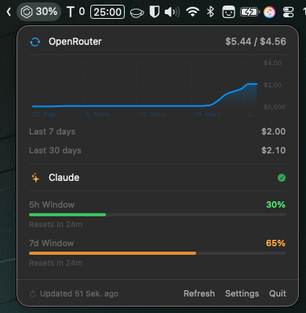

<p align="center">
  
</p>

<h1 align="center">Token Ticker</h1>

<p align="center">
  A lightweight macOS menubar app that tracks your AI spend in real time.<br>
  OpenRouter balance, Claude session usage — always one glance away.
</p>

<p align="center">
  
  
  
</p>

<p align="center">
  
</p>

---

## Features

- **OpenRouter** — live credit balance, 7-day and 30-day spend, cumulative chart
- **Claude** — current 5-hour session utilisation with visual indicator
- **Menubar display** — optionally show OpenRouter balance or Claude session % next to the icon
- **Configurable** — choose which metrics to show, chart period (7d / 30d), refresh interval
- Universal binary — runs natively on Apple Silicon and Intel

## Install

Download the latest **Token-Ticker.dmg** from [Releases](../../releases), open it, and drag Token Ticker to your Applications folder.

> **Note:** The app is ad-hoc signed (not notarized). On first launch, right-click → Open to bypass Gatekeeper.

## Setup

### OpenRouter
1. Open Settings → Providers → OpenRouter
2. Enable and paste a **Management Key** (not a regular API key)
   - Create one at [openrouter.ai/settings/management-keys](https://openrouter.ai/settings/management-keys)

### Claude
1. Open Settings → Providers → Claude
2. Follow the in-app instructions to copy your session cookie from claude.ai DevTools

## Build from source

Requires Xcode Command Line Tools (`xcode-select --install`).

```bash
git clone https://github.com/VincentRuoka/tokenTicker.git
cd tokenTicker
./build.sh          # compiles universal binary → build/token-ticker.app
./create_dmg.sh     # packages → build/Token-Ticker-<version>.dmg
```

## Requirements

- macOS 14 Sonoma or later
- OpenRouter Management API key (for OpenRouter tracking)
- claude.ai account session cookie (for Claude tracking)

## License

MIT
